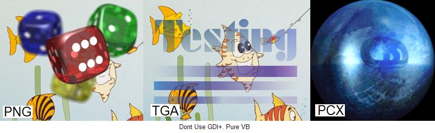



## EGL\_PngTgaPcx

### Description

(Reduce)PNG,TGA and PCX image viewer. Review of original code by Alfred Koppold. Understanding bitmap struct, file formats, BitPerPixel ,Bit depth ,RLE and LZ77 compression method,32bit DIB,

transparency etc. Useful(zip:320kb)
 
### More Info
 

             |
---                |---
**Submitted On**   |2009-01-22 17:36:46
**By**             |[Erkan Sanli](https://github.com/Planet-Source-Code/PSCIndex/blob/master/ByAuthor/erkan-sanli.md)
**Level**          |Intermediate
**User Rating**    |4.1 (33 globes from 8 users)
**Compatibility**  |VB 4\.0 \(16\-bit\), VB 4\.0 \(32\-bit\), VB 5\.0, VB 6\.0, ASP \(Active Server Pages\) , VBA MS Access, VBA MS Excel
**Category**       |[Graphics](https://github.com/Planet-Source-Code/PSCIndex/blob/master/ByCategory/graphics__1-46.md)
**World**          |[Visual Basic](https://github.com/Planet-Source-Code/PSCIndex/blob/master/ByWorld/visual-basic.md)
**Archive File**   |[EGL\_PngTga2141561262009\.zip](https://github.com/Planet-Source-Code/erkan-sanli-egl-pngtgapcx__1-71666/archive/master.zip)

